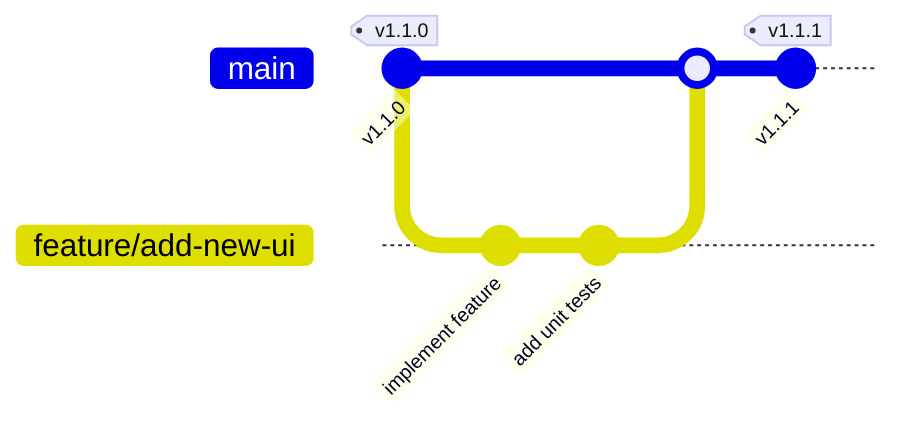

# 開發與發布工作流程 (Development & Release Workflow)

本文件說明專案的日常開發分支管理策略，以及如何進行版本發布。

---

## 1. 分支管理策略 (GitHub Flow)

為了保持程式碼的穩定性與部署的流暢度，專案採用簡化的 **GitHub Flow** 工作流程：



### 核心原則
1. **`main` 分支永遠保持穩定**：`main` 分支上的程式碼必須隨時可以正常建置、打包並執行。不應直接在 `main` 上進行未經驗證的功能修改。
2. **使用功能分支開發**：所有新功能、Bug 修正或介面調整，都應從 `main` 切出獨立的分支進行（例如：`feature/add-serial-monitor` 或 `fix/compile-error`）。
3. **測試通過後合併**：功能分支在本地或 CI 驗證無誤後，再合併回 `main` 分支。

---

## 2. 日常開發與測試

### 本地雙端開發環境
在開發過程中，可同時啟動後端編譯伺服器與前端 Vite 開發伺服器：

```bash
# 啟動開發伺服器 (包含前端監聽與後端服務)
npm run dev
```

* **後端伺服器 (HTTP/HTTPS)**：監聽於 `https://127.0.0.1:3000`
* **前端 Vite 開發環境**：監聽於 `http://localhost:5173`
* **舊版/Legacy 測試網頁**：隨時可造訪 `https://127.0.0.1:3000/test/index.html` 進行原生 API 呼叫測試。

---

## 3. 正式版本發布步驟

當累積了足夠功能並確認 `main` 分支的程式碼已經穩定，即可進行新版本發布。

> [!NOTE]
> 專案配置了 GitHub Actions 自動化打包。**只有推送 `v*` 格式的 Git Tag 時**，才會觸發雲端打包，一般的 `git push` 不會啟動打包流程。

### 步驟 1. 更新版本號
在根目錄的 `package.json` 中更新 `"version"` 欄位（例如將 `1.1.0` 改為 `1.1.1`），並同步更新 `package-lock.json`：
```bash
# 修改 package.json 之後，執行此指令同步 lock 檔案
npm install
```

### 步驟 2. 提交變更並推送至 GitHub
將版本號修改與穩定的程式碼推送到遠端 `main` 分支：
```bash
git add .
git commit -m "chore: bump version to v1.1.1"
git push origin main
```

### 步驟 3. 建立並推送版本標籤 (Tag)
建立對應的 Git Tag，並推送至 GitHub。這會自動觸發 GitHub Actions：
```bash
git tag v1.1.1
git push origin v1.1.1
```

### 步驟 4. 檢查 GitHub Actions 與 Release
1. 前往 GitHub 專案頁面的 **Actions** 頁籤，確認 `Build and Release Electron App` 工作流正在順利執行。
2. 建置完成後（約需 3-5 分鐘），工作流會自動在專案的 **Releases** 頁面建立一個 `v1.1.1` 的 Release。
3. 自動編譯出的 Windows Portable 執行檔 (`Maker IDE 1.1.1.exe`) 會自動上傳作為該 Release 的 Attachments。

---

## 4. 本地手動打包桌面程式

如果您需要在本地電腦上直接打包測試，不透過 GitHub Actions：

```bash
# 執行本地打包 (輸出至 release/ 資料夾)
npm run pack:desktop
```
打包完成後，可在 `release/` 資料夾下找到 `Maker IDE <版本號>.exe` 執行檔。
